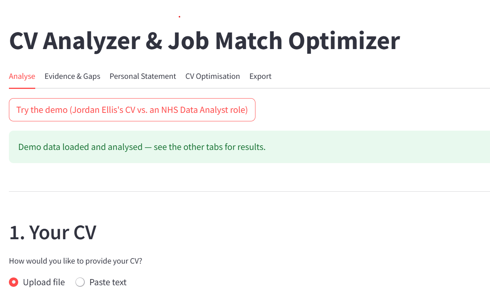
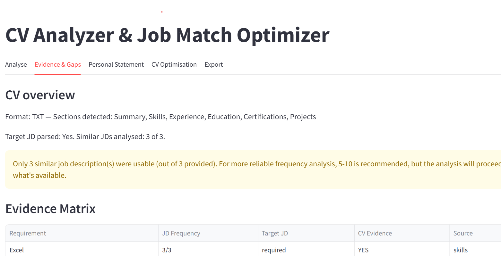
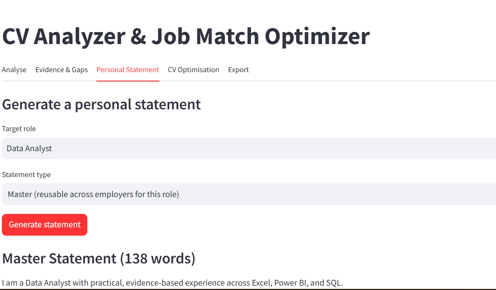
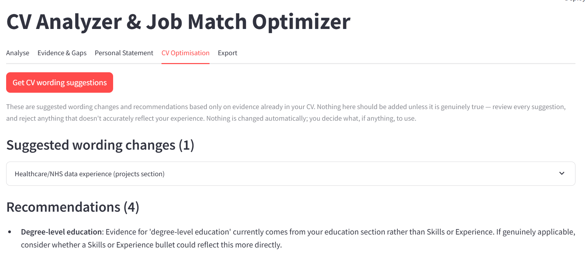
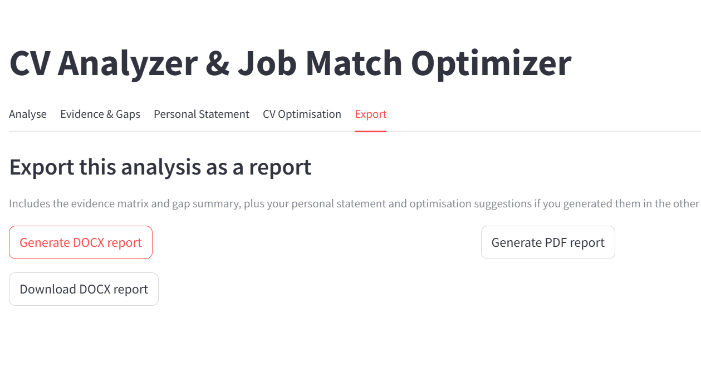

# CV Analyzer & Job Match Optimizer

A Python application that analyses a candidate's CV against a real job
description — and, optionally, several similar job descriptions for the
same role — to produce a transparent, evidence-based match report, an
honest personal statement, and reviewable CV wording suggestions.

**Every claim it makes is traceable back to something the CV actually
says. It never invents a skill, qualification, or achievement.**

---

## Table of contents

- [Business problem](#business-problem)
- [Why it matters](#why-it-matters)
- [Screenshots](#screenshots)
- [Features](#features)
- [Architecture](#architecture)
- [Technology stack](#technology-stack)
- [How it works](#how-it-works)
- [Evidence & scoring methodology](#evidence--scoring-methodology)
- [Installation](#installation)
- [Usage](#usage)
- [Example analysis](#example-analysis)
- [Security & privacy](#security--privacy)
- [Testing](#testing)
- [Future improvements](#future-improvements)
- [Skills demonstrated](#skills-demonstrated)

---

## Business problem

Most CV-matching tools either:
1. Score a CV against a generic "ideal CV" template that has nothing to
   do with the actual vacancy, or
2. Use an AI model to rewrite a CV in a way that quietly invents
   experience the candidate doesn't have.

Both approaches produce advice that's either irrelevant or dishonest.
This project takes a different position: **the job description is the
benchmark, not a template — and nothing gets said about a candidate
that isn't backed by real evidence in their CV.**

## Why it matters

For real job applications — especially structured ones like NHS or
Civil Service roles, which are scored against an explicit person
specification — generic keyword-stuffing advice is actively harmful. A
candidate needs to know, specifically:
- Which requirements they can already evidence, and where
- Which requirements they have *related* (transferable) evidence for,
  honestly framed as such
- Which requirements they have no evidence for at all — and should
  never claim to

This tool answers exactly that question, and nothing more.

## Screenshots

*(Add your own screenshots here — see below for exactly what to capture.)*

| Screen | Description |
|---|---|
|  | Upload/paste a CV, paste the target job description, add similar job descriptions |
|  | The evidence matrix and gap analysis summary |
|  | A generated statement with quality scores |
|  | Reviewable wording suggestions, approved individually |
|  | DOCX/PDF report download |

**To capture your own:**
1. Run `streamlit run streamlit_app.py`
2. Click "Try the demo" (or use your own CV/job description)
3. Take a screenshot of each tab (Windows: `Win + Shift + S`)
4. Save them into a `screenshots/` folder in the project root, named to
   match the table above (`01-analyse.png`, `02-evidence-gaps.png`, etc.)
5. They'll then render automatically here and on GitHub

## Features

- **CV parsing** — PDF, DOCX, TXT, or pasted text; detects Summary,
  Skills, Experience, Education, Certifications, and Projects sections
- **Multi-job-description analysis** — analyses one target job
  description plus 5–10+ similar adverts for the same role, to identify
  which requirements recur across the market rather than relying on one
  employer's wording
- **Evidence Matrix** — for every requirement identified: how often it
  appeared, how the target role framed it (required/preferred/
  responsibility/competency), and exactly what evidence (if any) exists
  in the CV, with the source section and snippet
- **Gap analysis** — every requirement is classified into one of four
  distinct outcomes: *has direct evidence*, *has transferable evidence*,
  *needs stronger evidence*, or *is a genuine gap* — never blurred
  together
- **Personal statement generation** — three tiers:
  - **Master** — reusable across employers for the same role
  - **Industry** — the Master statement adapted toward one sector
  - **Vacancy** — tailored to one specific job description
- **Statement quality checks** — Coverage, Evidence, Keyword Relevance,
  and Natural Language scores, plus a 13-point checklist, explicitly
  framed as internal indicators, not a guarantee of interview success
- **CV optimisation suggestions** — concrete before/after wording
  changes where genuine evidence supports one, and advisory
  recommendations elsewhere — approved individually by the user, never
  applied automatically
- **Optional AI-assisted phrasing** — off by default; when enabled,
  rewrites a statement for more natural flow, with every response
  checked against the same gap analysis and automatically rejected if
  it appears to add anything not already evidenced
- **Country/industry context** — optional, clearly-caveated general
  background (e.g. "a UK CV is usually called a CV, not a resume"),
  kept structurally separate from the evidence engine — it never
  influences scoring or matching
- **Export** — professional DOCX and PDF reports
- **Two interfaces** — a CLI (`app.py`) and a Streamlit web UI
  (`streamlit_app.py`), both built on the exact same tested engine

## Architecture

```
cv_analyser/
├── app.py                  # CLI entry point + testable orchestration functions
├── streamlit_app.py        # Web UI (thin layer over the same orchestration functions)
├── config.py                # Central configuration, .env loading
├── analysis_bundle.py       # Shared result-bundle type (avoids a circular import)
│
├── cv_parser.py             # CV text extraction + section detection
├── job_parser.py            # Single job description -> categorised requirements
├── requirement_miner.py     # Free-text requirements -> canonical phrases (vocabulary)
├── similar_jobs.py          # Orchestrates target + multiple similar job descriptions
├── frequency_analyser.py    # Cross-JD requirement frequency counts
├── evidence_mapper.py       # Builds the Evidence Matrix (CV vs. requirements)
├── gap_analyser.py          # Classifies each requirement's evidence status
│
├── personal_statement.py    # Master/Industry/Vacancy statement generation
├── statement_quality.py     # Scoring + 13-point quality checklist
├── ai_phrasing.py           # Optional AI rewrite layer, with a fabrication guardrail
├── optimiser.py             # CV wording suggestions + recommendations
├── report_generator.py      # DOCX/PDF export
├── reference_data.py        # Optional country/industry context (JSON-backed)
│
├── data/benchmarks/         # Country/industry reference JSON files
├── sample_data/             # Fictional CV + job descriptions for testing/demo
└── tests/                   # 101 tests covering every module above
```

Each module has one job and is independently tested. `app.py` and
`streamlit_app.py` contain no analysis logic of their own — they only
call into the modules above and handle presentation.

## Technology stack

| Purpose | Library |
|---|---|
| PDF/DOCX reading & writing | `pdfplumber`, `python-docx` |
| PDF report generation | `reportlab` |
| Web UI | `streamlit` |
| Optional AI layer | `requests` (OpenAI-compatible API), `python-dotenv` |
| Testing | `pytest` |

No heavyweight NLP/ML dependency — matching is deliberately rule-based
(curated vocabulary + word-boundary regex), which keeps every match
traceable to a literal phrase instead of an opaque model decision.

## How it works

```
CV  ------------------> cv_parser --> structured CV (sections, skills, experience)
Target JD -----------> job_parser --> structured requirements (PRIMARY source of truth)
Similar JDs ----------> similar_jobs --> job_parser x N --> requirement_miner x N
                                                                |
                                                                v
                                                     frequency_analyser
                                          (e.g. "SQL: required, 8/10 similar JDs")
        structured CV -----------------------------------------|
                                                                v
                                                     evidence_mapper
                                    (Requirement | Frequency | Target JD | CV Evidence | Source)
                                                                |
                                                                v
                                                      gap_analyser
                                                                |
                          statement tier (Master/Industry/Vacancy) --|
                                                                v
                                                   personal_statement
                                                                |
                                          optional  ai_phrasing (guardrailed)
                                                                |
                                                                v
                                                   statement_quality
                                                                |
                                                                v
                                          optimiser + report_generator
```

## Evidence & scoring methodology

- **Requirement categorisation** comes from the target job description's
  own section headers (Essential/Desirable, Responsibilities,
  Values/Behaviours) — not assumed.
- **Frequency** across similar job descriptions is reported as a plain
  fact (e.g. "8/10") and is explicitly **never** treated as a proxy for
  importance — that would contradict the target JD's own framing.
- **Evidence status** is one of four values, and the code path that
  decides which one is used is a single, exhaustive mapping — there is
  no way for evidence the candidate doesn't have to be reported as if
  they do:
  - `STRONG_MATCH` — found in Skills or Experience
  - `PARTIAL_MATCH` — found in Certifications/Education/Summary
  - `TRANSFERABLE` — a related term found in Projects, never presented
    as direct employment
  - `MISSING` — no evidence anywhere; never fabricated
- **Statement generation** only ever draws on `STRONG_MATCH`,
  `TRANSFERABLE`, and `PARTIAL_MATCH` entries — `MISSING` entries are
  excluded before any tier-specific selection logic runs, so there is no
  code path that can generate a sentence about something the candidate
  hasn't done.
- **Quality scores** (Coverage, Evidence, Keyword Relevance, Natural
  Language) are all simple, inspectable calculations — not model
  judgements — and are always shown with an explicit "not a guarantee"
  disclaimer.

## Installation

```bash
git clone <your-repo-url>
cd cv_analyser
python -m venv .venv

# Windows
.venv\Scripts\Activate.ps1
# macOS/Linux
source .venv/bin/activate

pip install -r requirements.txt
```

**Optional — AI phrasing layer:**
```bash
cp .env.example .env
# then edit .env with your own API key
```
The app works fully without this step.

## Usage

**CLI:**
```bash
python app.py
```
Menu options: analyse a CV alone, analyse against one job description,
or run the full multi-job-description analysis (recommended). Try
option 4 first — it loads built-in fictional sample data so you can see
the whole pipeline before using your own CV.

**Web UI:**
```bash
streamlit run streamlit_app.py
```
Opens in your browser. Five tabs: Analyse -> Evidence & Gaps -> Personal
Statement -> CV Optimisation -> Export.

## Example analysis

Fictional candidate ("Jordan Ellis") vs. a Data Analyst role at an NHS
trust, using 3 similar NHS Data Analyst adverts:

```
Requirement                      JD Frequency  Target JD    CV Evidence   Source
Excel                            3/3           required     YES           skills
Healthcare/NHS data experience   3/3           preferred    TRANSFERABLE  projects
Power BI                         3/3           required     YES           experience
SQL                              3/3           required     YES           experience
```

The NHS row is the clearest illustration of the whole approach: the
candidate has never worked in the NHS, but does have a personal project
analysing public NHS A&E data. The system reports this honestly as
**transferable** evidence — not as direct experience — and the
generated personal statement follows the same rule:

> *"I've also built relevant experience with healthcare data analysis
> through independent project work — NHS A&E Public Data Analysis
> (personal project)."*

## Security & privacy

- CVs are not stored permanently — parsed in memory for the duration of
  the analysis
- No CV content is logged
- The optional AI layer sends a generated *statement* (not the raw CV)
  to an external API only when explicitly enabled and confirmed by the
  user, with a visible warning before that happens
- `.env` (containing any API key) is git-ignored; `.env.example` shows
  the required shape with no real secrets
- Sample data (`sample_data/`) is entirely fictional — no real person's
  CV or confidential recruitment material is included

## Testing

```bash
pytest tests/ -v
```

101 tests across every module, including deliberate adversarial cases —
e.g. tests that construct a fabricated AI response and confirm it gets
rejected, and tests that probe for false-positive keyword matches (a
real bug class found and fixed during development: a canonical phrase's
own name being wrongly treated as a safe, unambiguous match target).

## Future improvements

- PDF/DOCX export of a fully rewritten CV (not just suggestions)
- Semantic (not just literal) requirement matching
- LinkedIn profile import
- Multi-vacancy comparison and application tracking
- Deployment to Streamlit Community Cloud for shareable access

## Skills demonstrated

Python - data processing - rule-based NLP/pattern matching - document
parsing (PDF/DOCX) - document generation (DOCX/PDF) - API integration -
optional generative-AI integration with safety guardrails - Streamlit
web development - CLI application design - software architecture
(separation of orchestration from presentation) - test-driven
development (101 tests) - systematic bug-finding through adversarial
testing - UX writing for sensitive, evidence-based recommendations
